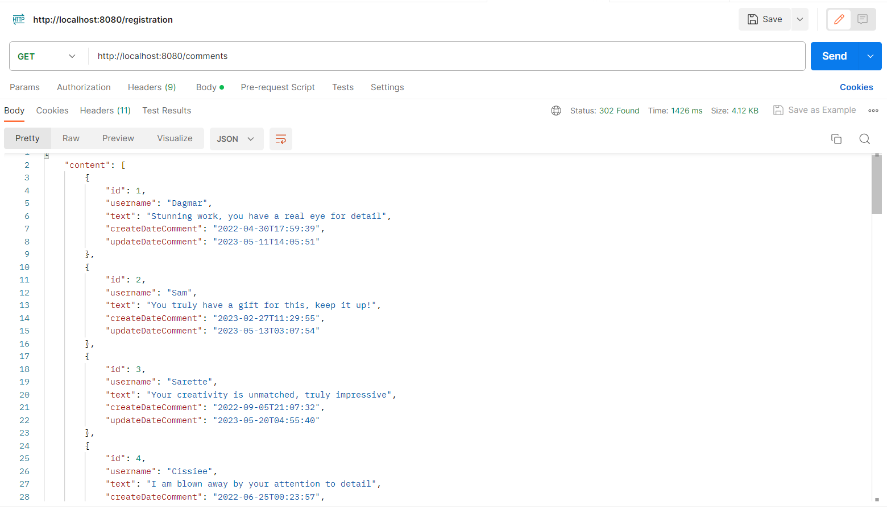
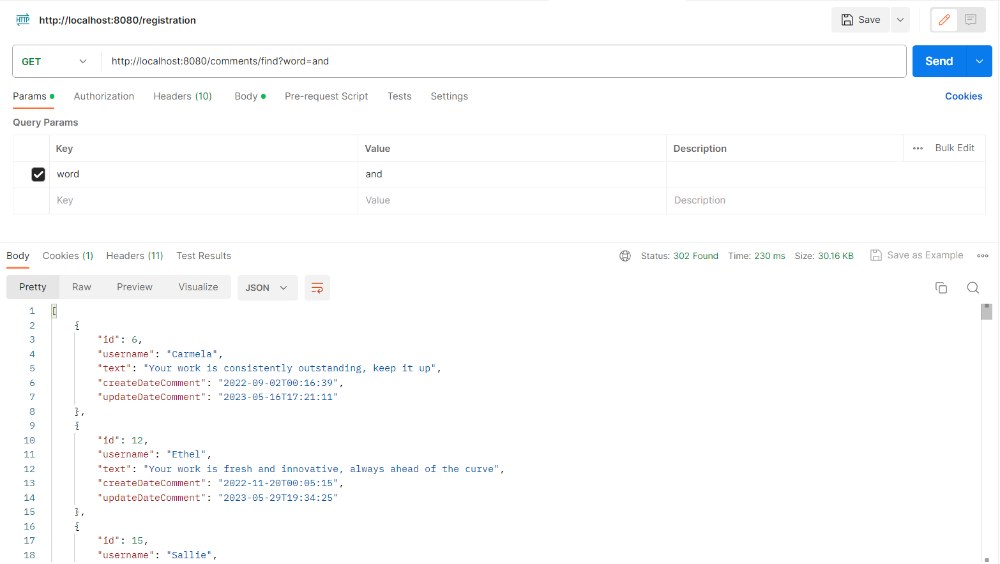
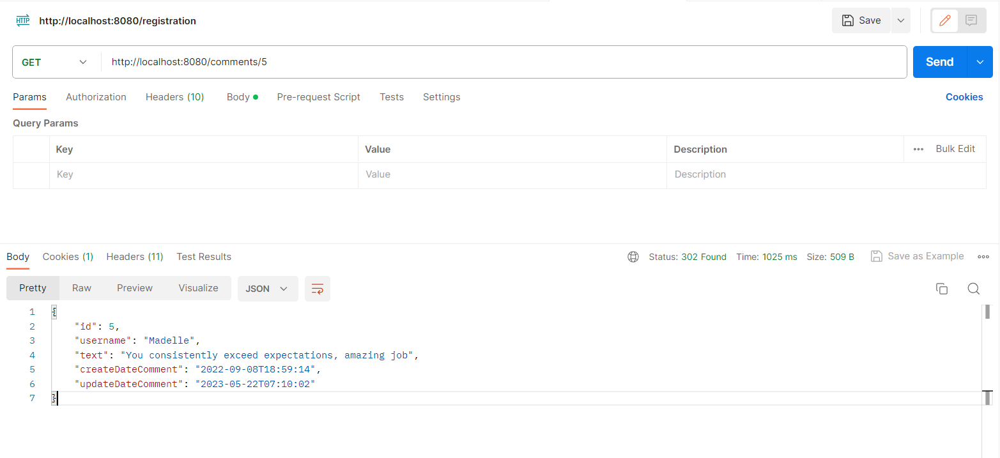
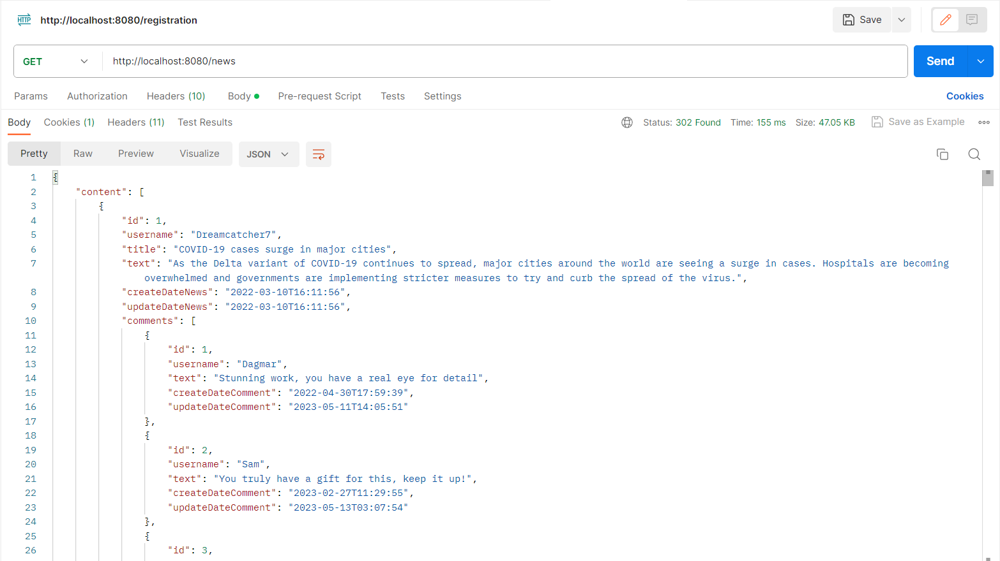
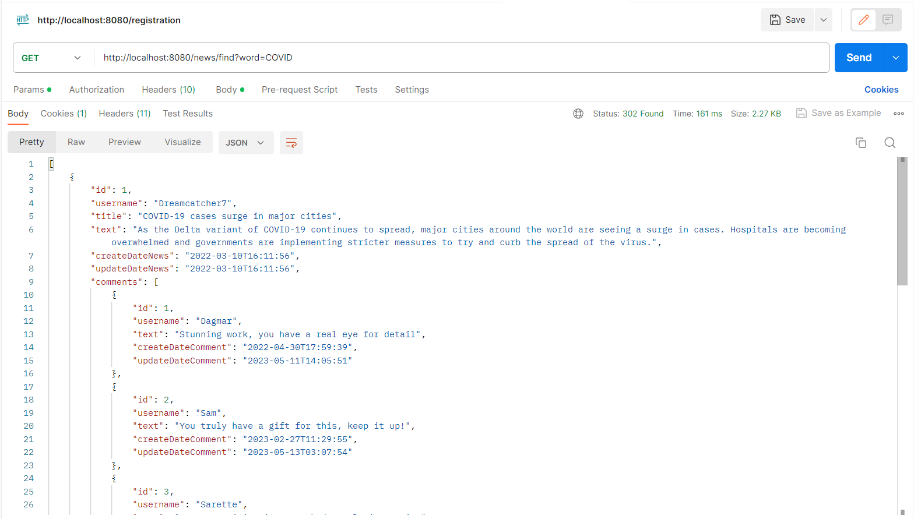
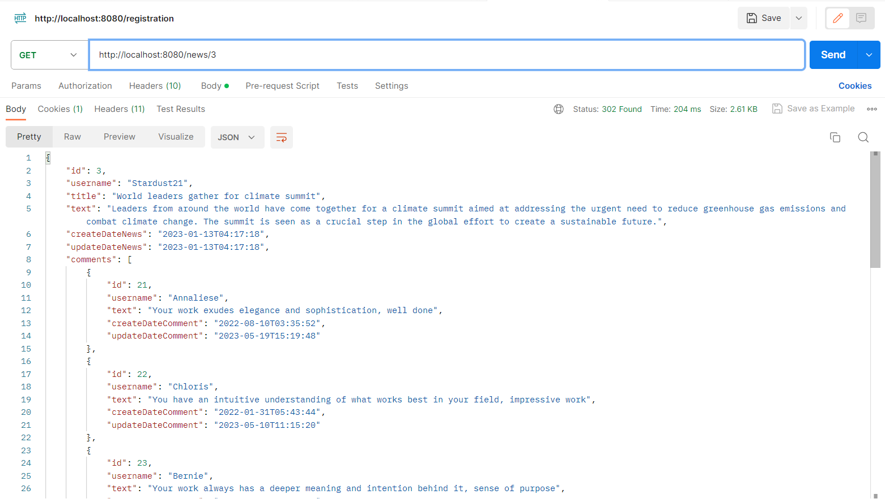

<h1 align="center"> RESTful NewsService</h1>
<h2 align="center">Author: <a href="https://github.com/Alivit" target="_blank">Chuiko Vitaliy</a></h2>
<h2 align="center">Введение</h2>
Всем привет, я здесь, чтобы продемонстрировать работу своей программы. 
По заданию требовалось разработать RESTful web-service, реализующей функционал для работы с системой управления новостями.

<h2 align="center">Требования</h2>
Требования которые нужно было выполнить в данном проекте:

1. Использовать Spring Boot 3.x, Java 17, Gradle и PostgreSQL.
2. Разработать API согласно подходам REST (UI не надо):
    -  CRUD для работы с новостью
    -  CRUD для работы с комментарием
    -  просмотр списка новостей (с пагинацией)
    -  просмотр новости с комментариями относящимися к ней (с пагинацией)
    -  полнотекстовый поиск по различным параметрам (для новостей и комментариев)
    -  Для потенциально объемных запросов реализовать постраничность
3.  Разместить проект в любом из публичных git-репозиториев (Bitbucket, github, gitlab)
4.  Код должен быть легко читаемый и понятный, с использованием паттернов проектирования
5.  Реализовать на основе   Spring @Profile (e.g. test & prod) подключение к базам данных.
6.  Подключить liquibase:
    - при запуске сервиса накатываются скрипты на рабочую БД (генерируются необходимые таблицы из одного файла и наполняются таблицы данными из другого файла, 20 новостей и 10 комментариев, связанных с каждой новостью
    - при запуске тестов должен подхватываться скрипт по генерации необходимых таблиц + накатить данные по заполнению таблиц (третий файл)
7.  Создать реализацию кэша, для хранения сущностей. Реализовать два алгоритма LRU и LFU. Алгоритм и максимальный размер коллекции должны читаться из файла application.yml. Алгоритм работы с кешем:
    - GET - ищем в кеше и если там данных нет, то достаем объект из dao, сохраняем в кеш и возвращаем
    - POST - сохраняем в dao и потом сохраняем в кеше
    - DELETE - удаляем из dao и потом удаляем в кеша
    - PUT - обновление/вставка в dao и потом обновление/вставка в кеше.
8.  Весь код должен быть покрыт юнит-тестами (80%) (сервисный слой – 100%)
9.  Реализовать логирование запрос-ответ в аспектном стиле (для слоя Controllers), а также логирование по уровням в отдельных слоях приложения, используя logback
10.  Предусмотреть обработку исключений и интерпретацию их согласно REST (см. https://spring.io/blog/2013/11/01/exception-handling-in-spring-mvc)
11.  Все настройки должны быть вынесены в *.yml
12.  Код должен быть документирован @JavaDoc, а назначение приложения и его интерфейс и настройки должны быть описаны в README.md файле
13.  Использовать Spring REST Docs или другие средства автоматического документирования (например asciidoctor https://asciidoctor.org/docs/asciidoctor-gradle-plugin/ и т.д) и/или Swagger (OpenAPI 3.0)
14.  Использовать testcontainers в тестах на persistence layer (для БД)
15.  Написать интеграционные тесты
16.  Использовать WireMock в тестах для слоя clients
17.  Использовать Docker (написать Dockerfile – для spring boot приложения, docker-compose.yml для поднятия БД и приложения в контейнерах и настроить взаимодействие между ними)
18.  (*) Подключить кэш провайдер Redis (в docker) (в случае реализации, использовать @Profile для переключения между LRU/LFU и Redis)
19.  (*) Spring Security:
     -  API для регистрации пользователей с ролями admin/journalist/subscriber
     -  Администратор (role admin) может производить CRUD-операции со всеми сущностями
     -  Журналист (role journalist) может добавлять и изменять/удалять только свои новости
     -  Подписчик (role subscriber) может добавлять и изменять/удалять только свои комментарии
     -  Незарегистрированные пользователи могут только просматривать новости и комментарии
     -  Создать отдельный микросервис с реляционной базой (postgreSQL) хранящей
        информацию о пользователях/ролях. Из главного микросервиса (отвечающего за
        новости) запрашивать эту информацию по REST с использованием spring-cloud-
        feign-client.
20.  (*) Настроить Spring Cloud Config (вынести в отдельный сервис и настроить разрабатываемый сервис на получение их в зависимости от профиля)
21.  (*) Реализацию логирования п.10 и обработку исключений вынести в отдельные
       spring-boot-starter-ы.
22.  (*) Сущности веб интерфейса (DTO) должны генерироваться при сборке проекта из.proto файлов (см. https://github.com/google/protobuf-gradle-plugin)

<h2 align="center">Технологии</h2>
Технологии которые использовались в данном проекте:

- Java 17.
- Gradle 8.0.
- Postgresql 15.
- Spring 6.0.8.
- Spring Boot 3.1.0
- Spring-boot-starter-data-redis
- Spring-boot-starter-data-jpa
- Spring-boot-starter-validation
- Spring-boot-starter-web
- Spring-boot-starter-security
- Spring-boot-starter-actuator
- Spring Cloud
- Spring-cloud-starter-config
- Springdoc-openapi-starter-webmvc-ui 2.1.0
- Liquibase
- Lombok
- Junit 5.7.1.
- Testcontainers postgresql 1.16.3
- Wiremock-standalone 3.0.0-beta-8
- Docker.

Также были написаны свои кастомные стартеры:

- [exception-handler-starter](exception-handler-starter)
- [logging-starter](logging-starter)

И отдельный микросервис для прочтения настроек проекта из удалённого репозитория с помощью Spring Cloud:

- [spring-cloud-service](spring-cloud-service)

<h2 align="center">Инструкция для запуска приложения</h2>

1. Для того чтобы приложения хорошо запускалось нужно чтобы все технологии строго были похожи на те которые описаны выше.
2. Все настройки проекта лежат в [application-dev.yml](src/main/resources/application-dev.yml)
   и также в [news-configuration.yml](https://github.com/Alivit/SpringCloudConfigService/tree/master/configuration) который лежит в удалённом репозитории.
   Чтобы получить данные из [news-configuration.yml](https://github.com/Alivit/SpringCloudConfigService/tree/master/configuration), нужно запустить [spring-cloud-service](spring-cloud-service) а потом главный сервис.
3. Для работы с базой данной был подключён liquibase и написаны 2 скрипта один для создания таблиц, другой для их заполнения.
   В [application-dev.yml](src/main/resources/application-dev.yml) или [news-configuration.yml](https://github.com/Alivit/SpringCloudConfigService/tree/master/configuration) нужно будет только прописать ваши данные по postgres для подключения.
4. В [application-dev.yml](src/main/resources/application-dev.yml) или [news-configuration.yml](https://github.com/Alivit/SpringCloudConfigService/tree/master/configuration) можно переключать cache LFU/LRU, настраивать их размерность, 
   включить или выключить использования [exception-handler-starter](exception-handler-starter) или [logging-starter](logging-starter).
5. Запустить [NewsServiceApplication.java](src/main/java/ru/clevertec/news/NewsServiceApplication.java)
6. Проект готов к работе.

<h2 align="center">Инструкция для запуска приложения в Docker</h2>

1. Должен быть установлен сам Docker.
2. Запустить `./gradlew build`.
3. Запустить [docker-compose.yml](docker-compose.yaml).
4. Проект готов к работе.

<h2 align="center">Пример работы программы</h2>
http://localhost:8080/comments

http://localhost:8080/comments/find?word=and

http://localhost:8080/comments/5

http://localhost:8080/news

http://localhost:8080/news/find?word=COVID

http://localhost:8080/news/3

